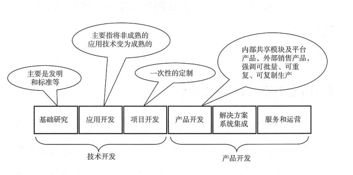
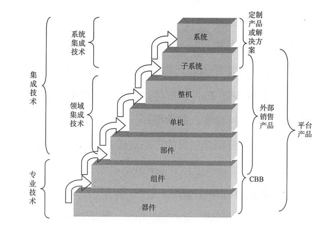
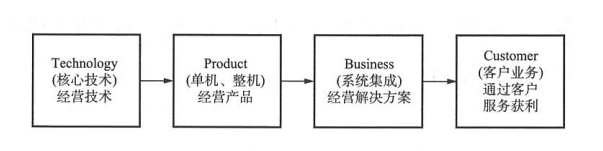
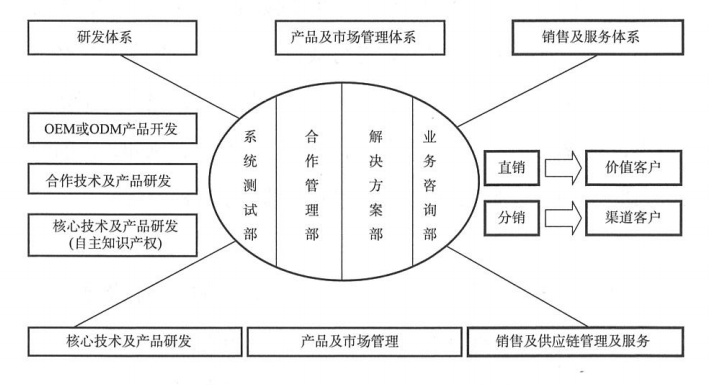

- # 介绍
  - 本次学习挑战一周内，完成华为《产品研发管理》这本书的理解性阅读，结合当前实际情况，写写心得，记录要点方法。
    - 开篇简介非常实在，我的眼光落在了责任两个字，因为信心可以有长时间的也可以有短时间内的，但责任是要时时刻刻落在肩上的，无论是为别人还是为自己。
    - 华为是我比较认同的一家好企业，可能对老总比较熟知，因为他也是军人，所以多多少少感觉，华为这个公司与自己有种莫名的联系。
    - 同样能够读到这本书也是一种缘分，希望能向作者学习到多年积累的经验，让自己更上一层楼。
  - 
  - 作者说研发管理体系可以复制，来源于信心，实践后的信心。我思考的是在这个过程中，实践过程中是否有针对每个实践公司的特殊处理，管理体系真的是华为的原班内容吗？
  - 每个公司的情况根据项目、人员、环境、客户的不同，相同的管理体系都能够兼容吗？我相信能够适用，就是想了解它的改动和优化有哪些方向？
  - 很认同作者说的，中国大部分的技术型企业，眼睛只盯着技术和财务，拿着产品找需求，从不关心共享能力。
    - 作者提出的三种能力七类指标，这里我先记录三种能力：
      - 1、生成类能力指标
      - 2、可持续发展能力指标
      - 3、核心竞争力能力指标
    - 同样，我国的一些企业与世界优秀企业在研发管理上如书中所述一样，最大的差距来源于“责任”。在任何一家企业都能看到这样的人员存在，而相对与世界级优秀企业中的所见所闻，管理层不论是执行力还是责任心，都可以从产品中体现出来。
    - 就拿汽车行业来说，群众的眼睛是雪亮的，用户的口碑才是产品的丰碑。那辆车子质量好坏，用过了自然就有了对比。同样的零件、药品、材料、食品等等，为什么大众选择了进口，而非国产。诚然我的爱国之心熊熊燃烧，支持国产，都被这样的“责任”给破坏了。  
  - 书中列举了多个类比要素
    - 产品规划：国内技术型企业（大部分）设计是没有特定的方向或者应用方向，面向通用市场，非细分市场；世界优秀技术型企业，为特定的细分市场和应用设计产品，产品线着眼世界市场，产品面向一个个细分市场。
      - 所有有许多国外的世界巨头，却少见中国有这样的，不过目前了解到的有数字跳动——Tik Tok，算是一个短视频领域的世界现象。
    - 接下来就不一一列举，只做比较有鲜明对比的几个方面
    - 开发过程：设计过程产品需求和规格不断变化，没有基线控制；反之人家根据明确定义的产品需求和规格设计，有明确的规格、时间、成本基线控制。
    - 开发流程、开发责任人、开发团队：分段式开发，部门壁垒很重；项目分段设立，对技术和自己部门负责；团队通常指部门内容项目成员，没有资源投入和释放。反之执行的是IPD，跨部门全流程开发，产品经理以及对产品、市场、财务的成功负责的各个核心成员责任制，组成跨部门团队，分阶段投入和释放。
    - 质量管理、评审管理：通常是事后进行质量管理和归零管理，出了事自然是质量管理部背锅；技术管理和决策管理混乱，没有人对评审后的效果和结果负责。反之技术评审、角色评审、市场评审分离，实现设立主审人，主审人负责制。
    - 绩效管理：通常无财务和市场指标，基本上给需求项目就做，成不成功是公司的事情；组织绩效和个人绩效没有分离。反之都有明确的指标，财务、市场、过程指标相结合，包括交付、财务、竞争力、可持续发展等指标，组织和个人绩效分离，先考核组织绩效，在考核个人，如果团队目标都没有完成，不考虑个人绩效。
  - 
- # 集成产品的开发管理如何进行？
  - 目前国内几家大企业运用的就是，比如携程就是一市场为需求，将产品开发看成个创业进行投资，内部上市实现共享货架和跨部门的团队，准确、快速、高质量的完成出目标产品，在用户手上形成交付。
  - 书籍作者认为这是世界一流企业普遍采用的一套系统工具方法和策略，是企业不可跨越的阶段。
  - 技术型企业可以有Research类（技术开发），也可以是Development类（产品开发）。大多数国内企业是做产品开发，服务市场的。技术开发方向在于领先和影响，产品放行在于市场和财务。
  - 文章强调，执行集成产品研发（IPD）有四个重组：
    - 1、财务重组
    - 2、市场重组
    - 3、产品重组
    - 4、流程重组
    - 可以理解为每个项目都是一种投资，需要精打细算，完成对需求的开始到结束规划和设计，对过程进行分层、分仓、异步开发。实现整个流程的跨部门跨团队的管理体系。
    - 核心的思想就是：四四四模型
      - 四个产出流程
        - 战略流程
        - 市场流程
        - 产品开发流程
        - 技术和平台开发流程
      - 四个支撑流程
        - 项目管理
        - 绩效管理
        - 质量管理
        - 成本管理
      - 四大团队建设
        - IPMT（集成产品管理团队）
        - PMT（组合管理团队）
        - PDT（产品开发团队）
        - TDT（技术开发团队）
  - 
- # 技术型企业如何生存？
  - 先看看技术型企业通常会有哪些渠道进行产品输出
    - 基础研究：就是基于自然规律、科学理论的深入研究，从而产出发明及创新的事物，以及一些原理标准的产出。类似于华为的5G技术、云南白药的药方等等。
    - 应用技术：基于某种技术继续进行拓展开发，提供便捷实用的输出供应
    - 项目开发：定制性的服务
    - 产品开发：通过细分领域，完成客户需求，实现批量、重复、可复制生产
    - 解决方案：做方案设计
    - 服务和运营：通过平台维护、服务模式
  - 
  - ### 综上所述，以及对技术开发、产品开发的理解，我目前的公司基本就属于产品开发阶段，因为基础研究和技术开发的项目基本目的是确保技术的先进以及完成交付。而公司目前情况来看，产品开发、核心产品的解决方案、产品的运营和服务都是输入产品开发类，保障市场及财务，强调客户的需求基础上实现低成本、可复制、高质量。
  - 既然了解了公司的大致类型，就可以对着进行设计划分产品的层级，建立产品货架。
    - 以华为为例，通常对产品货架分层三类：
      - 元器件、材料、原料
      - 共享的模块或者部件（CBB，Common Building Blocks）
      - 既可共享又可独立销售的产品
  - 
  - 一个仓库有了货架，不能乱堆一气，需要进行明确的分类存储，在这按面向的对象或者说客户，一般分为：
    - 内部共享产品
    - 面向细分客户群的产品
    - 解决方案级产品
  - 技术型企业如何实现利润？
    - 有了仓库、有了原料、有了分类。实现产品后如何进行转化成有价值输出？这时候就要进行全面性规划，比如：
      - 在整个产品链中最底层的专业技术类（器件、组件、部件）
      - 企业级产品和集成技术相关类（单机、整机）
      - 企业系统集成和服务相关
      - 再有就是客户销售相关类
  - 
  - 通过以上几个方面可以看出，如果只是以产品为主的，没有自己的核心技术和解决方案，企业形成不了核心竞争力。而既有核心技术，又有核心产品，还有解决方案的，最具有竞争力。
  - 并可以看出实现以上架构是比较典型的产业链管理的系统集成公司。
  - 企业产品管理、市场管理是一个公司核心竞争力最重要的环节。华为和IBM都在为一种橄榄形架构努力，书籍提到以下架构特征：
    - 通过分销做规模客户，通过直销做价值客户
    - 业务咨询部确保对客户业务的理解
    - 解决方案部确保方案的总体性和系统性
    - 核心技术及核心产品自主开发，非核心技术通过合作和外包开发完善解决方案
    - 通过系统测试保证自己的产品和合作的产品的质量
  - 
- # 如何进行企业自我的升级？
  - 文中作者对百家技术企业总结分析后，分为了五个节点
    - 劳动密集型加工模式，比如富士康，企业核心竞争力在于劳动力和成本低。
    - 项目生存型模式，有一定技术，没有形成自己的产品和共享货架。人力控制由项目而定，维持生存，低盈利、管理难、项目杂。
    - 产品扩展型模式，有自己的产品和货架，可进一步进行扩展，产品供应和设备供应商大多为这类。
    - 运营型客户模式，有自己成熟产品，足够的客户为服务付费，企业稳定收入，并不断增加增值服务内容。
    - 集成性产业链管理模式，既有核心技术、核心产品，同时做企业的解决方案，通过资本运作可控制产业链。主要完善企业文化、流程建设、干部培养提升企业核心竞争力。
 

