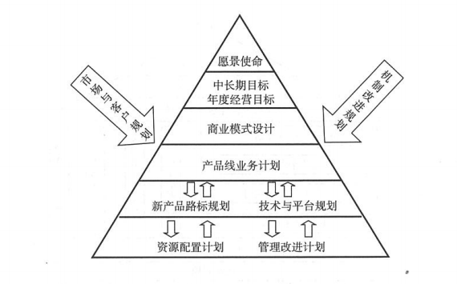
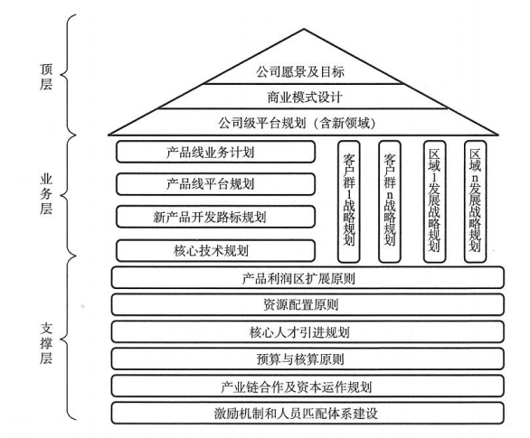
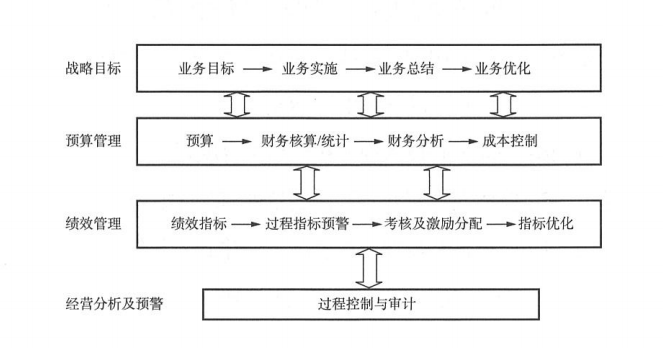
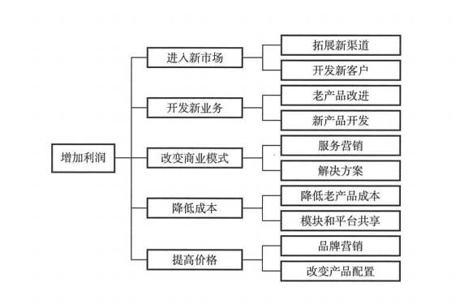

- 看完第一章，一口气就读完了后面的二三四，详细讲述了一个产品从定位、管理、建设，在这里我要记录一下，其实书中是从管理、定位、建设角度去进行讲述的，不知道顺序影响不影响理解。
- 
- 这个层面的基本都是有高层管理进行制定，不论是市场还是核心技术、人员能力、资源配置，不是研发负责。
- 一般的产品战略、产品策略这些每个公司各有不同，不过我关注到的是资源配置方面，可以看的出一个企业的重心。这本书是写华为的，那么它在这个投入、突破、布局中是按“七二一”原则，就是七层聚焦，二层突破，一层布局。并在此强调，技术型企业的战略不仅关注财务，核心竞争力也是一个重要方向。
- ### 从企业的产品战略规划一般可以分为三个方面：
  - 战略研究层(顶层)
    - 作为企业公司的顶层架构设计，需要匹配公司创建使命愿景的战略目标、计划、定位。到这里为什么我在前面说产品是从定位到管理、到建设，原因就是这里，管理是去匹配定位的，建设是为管理服务的。主要的内容有：
      - 1、公司的愿景使命和战略目标
      - 2、公司的商业模式
      - 3、公司级平台规划及产品线分类原则
      - 4、新领域发展计划
  - 产品线战略规划层（业务层面）
    - 这里组要完成业务的规划，资源配置计划等等，主要包括：产品线业务、客户群、技术、平台、人力资源、财务等规划计划
  - 资源配置和管理改进层（支撑层）
    - 没有钱是万万不能的，有了钱也不是乱花的。资源配置管理既然是支撑作用，就要完成对公司方向和愿景层的规划，日常完成产出线的资源配置。完成核心人才引进计划，各类激励机制、人才匹配体系建设。制定预算核算原则
- 
- 
- 文中指出，很多公司战略无法达成，就是一直在顶层设计方面撂挑子，费时费力搞半天，没有达成业务层面的战略规划，而支援层面也没用横好的保障推进
- 
- ### 绩效指标绩效考核如何适配制定？
  - 前面有说过，企业层面大致分为了生存类能力指标、可持续发展能力指标、核心竞争能力指标，具体的内容就不明细了，可以去拜读一下《产品研发管理》。
  - 企业的KPI（关键绩效考核指标）需要最终完成分解，具体到月份、团队个人，从而明确每个员工的绩效。
  - 在绩效考核中又可以分为财务指标和非财务指标，比如产品的市场份额、客户满意度、产品质量、任职资格等
  - 有时候很多企业管理者经常将研发人员的技术个人指标与组织指标混在一起，把组织指标市场、财务指标分到了研发人员，这里要分清楚组织指标考核的是利润，个人指标考核的工作情况。
  - 这里结合近段时间学习的DevOps知识体系案例中，例如Spotify/Facebook文化体系当中，研发体系有一个很有意思的文化就是红绿灯，小队问题是通过颜色标记完成度或者情况说明的，每个人都会有自己的红灯，表示自己需要帮助。这里要说的是，他们从不把这类问题纳入考核指标，也不会将组织指标列入个人指标。
  - 唯一有关的就是，产品如果是不成功的，组织绩效谈何而来，只有组织绩效的成功，个人绩效才有意义，
- ### 如何获取产品在市场、财务上的成功？
  - 企业生存最大的因素就是利润，而市场、财务的成功又是围绕产品，回到原点，解决好产品的技术开发、产品开发问题是首要的。
  - 有些研发人员及研发管理考虑的是技术能力，追求搞技术能力高绩效，而降底了组织绩效权重，就算是一个顶尖的技术人才，不能为产品创造价值利润，我想也是白搭个人绩效
  - 对于产品为导向，还是技术为导向，前面有说过，你要做的技术型企业类型是技术研发、还是产品研发。就目前书中的观点是：对一个产品线的负责人来说，必须将组织绩效放在第一位。
  - 有点像我党，我深刻的记得一点就是个人利益必须服从集体利益，这里飘过一万份信仰之力。同样，部队中也是强调，单一目标服务于大局目标。毛主席说党指挥枪，应该就是这个道理，社会主义道路也可以有中国特色。
  - 所以，新技术新产品开拓市场不是唯一的道路，老产品同样也有春天
  - 比如文中指出的几条道路：
  - 
- ### 用好资源配置这座灯塔
  - 让企业持续发展，离不开合理的资源配置，老产品、新业务如何相互促进，持续增长，通常的资源比例就是“七二一”原则，七成聚焦、两成突破、一成投入。值得注意的是，研发与营销的资源配置在聚焦和突破方向配置是相反的。
- 完成以上定位导向，接下来就是管理的跟进，体系的搭建
- ### 