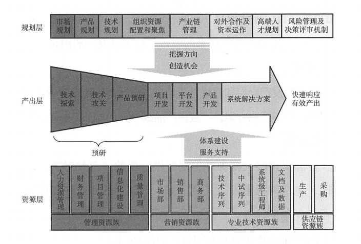
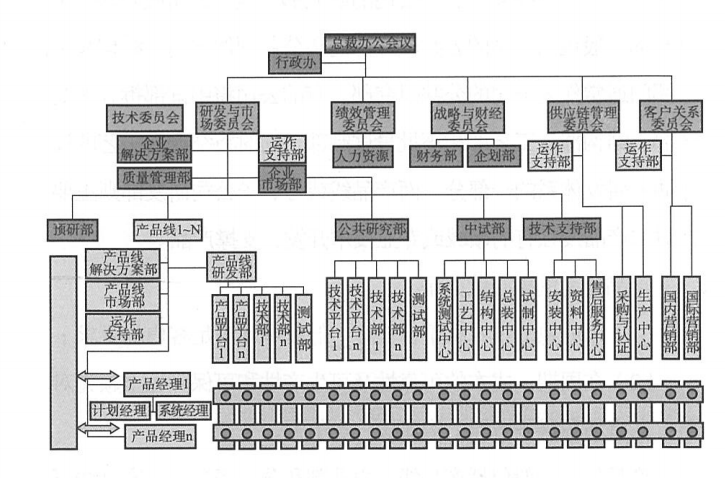
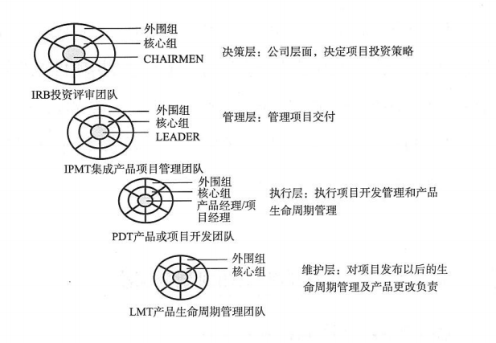
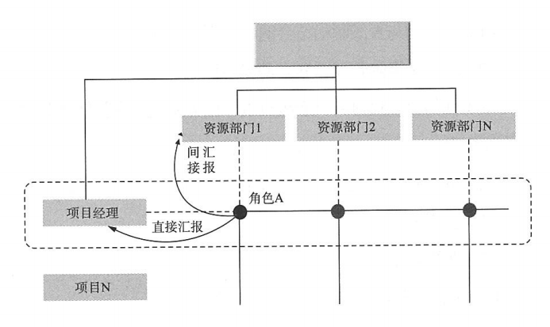
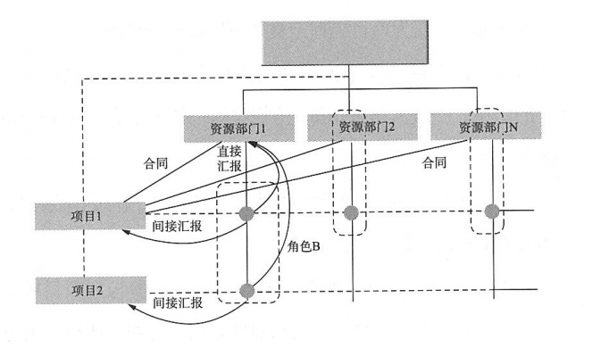

- 看完第一章，一口气就读完了后面的二三四，详细讲述了一个产品从定位、管理、建设，在这里我要记录一下，其实书中是从管理、定位、建设角度去进行讲述的，不知道顺序影响不影响理解。
- 这个层面的基本都是有高层管理进行制定，不论是市场还是核心技术、人员能力、资源配置，不是研发负责。
- 一般的产品战略、产品策略这些每个公司各有不同，不过我关注到的是资源配置方面，可以看的出一个企业的重心。这本书是写华为的，那么它在这个投入、突破、布局中是按“七二一”原则，就是七层聚焦，二层突破，一层布局。并在此强调，技术型企业的战略不仅关注财务，核心竞争力也是一个重要方向。
- ### 从企业的产品战略规划一般可以分为三个方面：
  - 战略研究层(顶层)
    - 作为企业公司的顶层架构设计，需要匹配公司创建使命愿景的战略目标、计划、定位。到这里为什么我在前面说产品是从定位到管理、到建设，原因就是这里，管理是去匹配定位的，建设是为管理服务的。主要的内容有：
      - 1、公司的愿景使命和战略目标
      - 2、公司的商业模式
      - 3、公司级平台规划及产品线分类原则
      - 4、新领域发展计划
  - 产品线战略规划层（业务层面）
    - 这里组要完成业务的规划，资源配置计划等等，主要包括：产品线业务、客户群、技术、平台、人力资源、财务等规划计划
  - 资源配置和管理改进层（支撑层）
    - 没有钱是万万不能的，有了钱也不是乱花的。资源配置管理既然是支撑作用，就要完成对公司方向和愿景层的规划，日常完成产出线的资源配置。完成核心人才引进计划，各类激励机制、人才匹配体系建设。制定预算核算原则
- 
- 
- 文中指出，很多公司战略无法达成，就是一直在顶层设计方面撂挑子，费时费力搞半天，没有达成业务层面的战略规划，而支援层面也没用横好的保障推进
- 
- ### 绩效指标绩效考核如何适配制定？
  - 前面有说过，企业层面大致分为了生存类能力指标、可持续发展能力指标、核心竞争能力指标，具体的内容就不明细了，可以去拜读一下《产品研发管理》。
  - 企业的KPI（关键绩效考核指标）需要最终完成分解，具体到月份、团队个人，从而明确每个员工的绩效。
  - 在绩效考核中又可以分为财务指标和非财务指标，比如产品的市场份额、客户满意度、产品质量、任职资格等
  - 有时候很多企业管理者经常将研发人员的技术个人指标与组织指标混在一起，把组织指标市场、财务指标分到了研发人员，这里要分清楚组织指标考核的是利润，个人指标考核的工作情况。
  - 这里结合近段时间学习的DevOps知识体系案例中，例如Spotify/Facebook文化体系当中，研发体系有一个很有意思的文化就是红绿灯，小队问题是通过颜色标记完成度或者情况说明的，每个人都会有自己的红灯，表示自己需要帮助。这里要说的是，他们从不把这类问题纳入考核指标，也不会将组织指标列入个人指标。
  - 唯一有关的就是，产品如果是不成功的，组织绩效谈何而来，只有组织绩效的成功，个人绩效才有意义，
- ### 如何获取产品在市场、财务上的成功？
  - 企业生存最大的因素就是利润，而市场、财务的成功又是围绕产品，回到原点，解决好产品的技术开发、产品开发问题是首要的。
  - 有些研发人员及研发管理考虑的是技术能力，追求搞技术能力高绩效，而降底了组织绩效权重，就算是一个顶尖的技术人才，不能为产品创造价值利润，我想也是白搭个人绩效
  - 对于产品为导向，还是技术为导向，前面有说过，你要做的技术型企业类型是技术研发、还是产品研发。就目前书中的观点是：对一个产品线的负责人来说，必须将组织绩效放在第一位。
  - 有点像我党，我深刻的记得一点就是个人利益必须服从集体利益，这里飘过一万份信仰之力。同样，部队中也是强调，单一目标服务于大局目标。毛主席说党指挥枪，应该就是这个道理，社会主义道路也可以有中国特色。
  - 所以，新技术新产品开拓市场不是唯一的道路，老产品同样也有春天
  - 比如文中指出的几条道路：
  - 
- ### 用好资源配置这座灯塔
  - 让企业持续发展，离不开合理的资源配置，老产品、新业务如何相互促进，持续增长，通常的资源比例就是“七二一”原则，七成聚焦、两成突破、一成投入。值得注意的是，研发与营销的资源配置在聚焦和突破方向配置是相反的。
- 完成以上定位导向，接下来就是管理的跟进，体系的搭建

- ### 管理的组织体系以何为导向？
  - 构成一个企业的完整输出其实包括：产品、服务、人员，人员能力的提升，也是企业重要的资产。让我想到马云说的一句话，阿里巴巴要对外输出人才，应该值得就是这个方面。
  - 技术型或者说科技型企业，和一般企业的有所不同，除了以市场和财务为导向，还要完成货架的建设，技术的积累，同时关注员工能力的提升和任职资格。
  - 因为多了数字财富这一层的维护，所以要对数字财富有所建设要求。
    - 分工，明确的分工管理
    - 员工的上升通道，专业方向，归属感
    - 立项目，对其进行项目管理和控制
    - 建团队，跨部门团队建设，全流程跟踪
    - 评审，对项目的评审，明确目标责任
  - 明确了要点、层次，针对其进行划分三类：
    - 规划类的活动
    - 产出开发类活动
    - 资源线的管理活动
  - 
  - 其实从上面可以联系当前公司情况，对应的就是委员会、产出线、资源线，是一种典型的技术型企业的组织结构。
  - 
  - 这图的内容就很好的体现了，技术开发与产品开发的分离，明确的各个体系的核心方向
    - 技术体系
      - 搭建平台，储备技术，技术突破
      - 制定技术标准、技术规划、人才培养
      - 建立公司级公共共享技术开发和产品线子公研究
    - ### 疑问速记：按以上的体系建设，当前公司的质量保障部，在研发中心的体系下，方向职能、人员能力建设是否跑偏？无论研发中心作为技术开发方向，还是产品开发方向，质量保障着眼公司级项目标准技术制定、技术规划、人才培养，结合测试体系（应该也要分离到项目外）。
    - 产品体系
      - 成熟技术、快速、低成本平台化客户要求
      - 高可靠、易生产、可保障
      - 建立生产线管理部，跨部门
    - 预研体系
      - 探索未来、研究产品、技术储备
      - 扩大技术领域影响力
      - 虚拟部门（流转性人员开发，因项目定人员）
  - 市场体系与销售体系有效分离相互协作
  - 产出线与资源线进行分离，生产线对产出负责，项目运作；资源线对人员规划、培养、职业通道负责
    - 这里可以联系到DevOps中的小队（产出线）与分队（资源线）关系
  - 决策与职能体系管理及职能体系分离
  - 系统设计与实现相对分离
  - 开发与测试和验证分离
  - 综合以上内容，可以看出一个企业的组织体系，一切围绕产品为中心，不论是市场销售体系的分离，还是产出和资源的分离，考虑的都是客户，因为最终产品还是交给客户，客户满意产品才行
  - 说了这么多产出线是什么，资源线做什么？
    - 简单理解的话就是一个小的跨部门组织，主要包括：
      - 公司级投资管理委员会-决策
      - 产品集成管理团队-管理
      - 执行项目开发管理-执行
      - 产品生命周期管理团队-维护服务
      - 
    - 资源线是服务性质的，兵马未动，粮草先行。高效的支撑为产出线提供优秀的资源，能使产品更快达成目标
      - 技术资源部
      - 营销资源部
      - 专业管理资源部
      - 生产及供应链资源部
    - 以上的支撑一般一对一，也有一对多，一对多的可以理解为公共资源
- ### 产出线与资源线的千丝万缕联系
  - 熟话说，一山不容二虎，有了交叉就会有重复，如何在跨部门多管理中理清楚，保障资源共享和人员的专业性，到这里，我终于看到了，开始时的部分答案。文中介绍并指出，并不是所有企业都是和实行矩阵管理，那些符合条件呢？
    - 企业要有“承诺文化”
    - 产品和专业的资源划分合理
    - 单项目、多项目分离
    - 体系层次清晰合理
    - 结构化流程清晰
    - 需求管理流程初步实行
  - ## 重点学习内容（105）：
  - 矩阵管理通常可以分：
    - 强矩阵
    - 
    - 弱矩阵
    - 
    - 混合矩阵
    