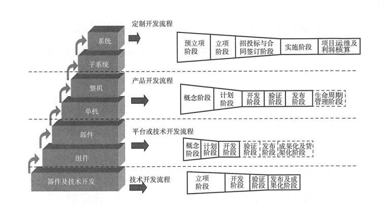
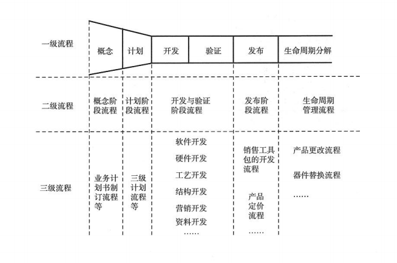
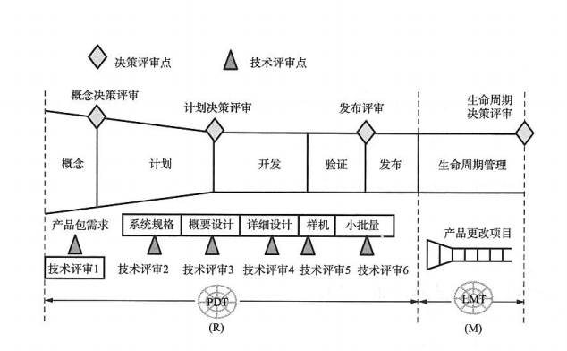
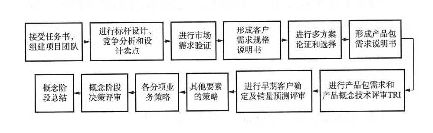
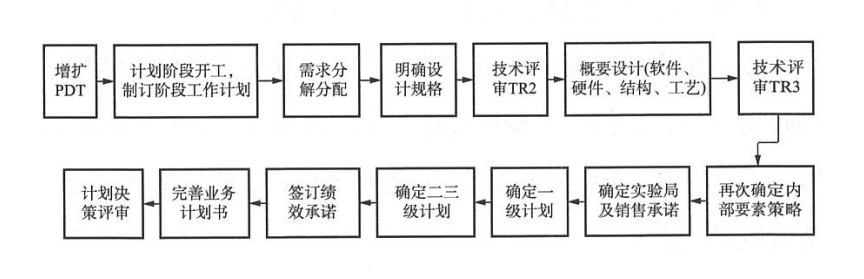
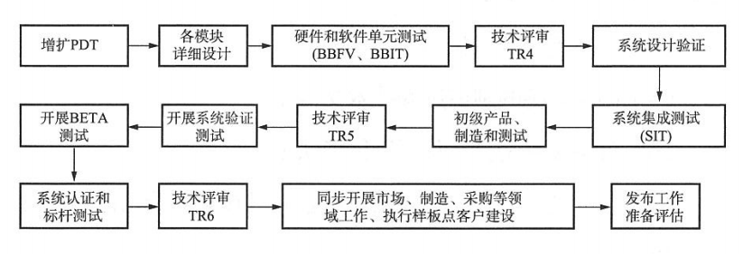
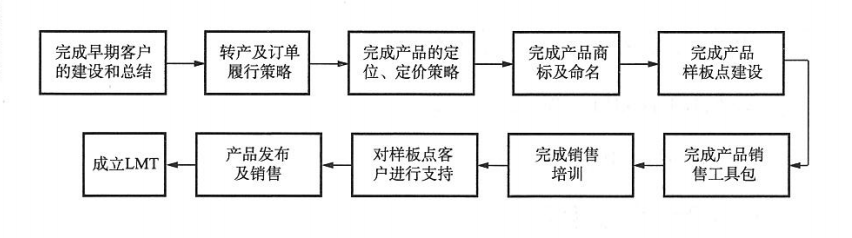
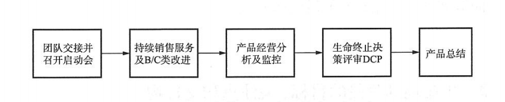

- 从目前发展的技术型企业来看，有很多公司原来的技术开发流程，走着走着就成了产品开发，或者混合开发，使产品的迭代和开发周期大大拉长。
- 那么我们公司做的到底是那一类？研发体系又是怎么走的？
  - 目前我们熟知的体系
    - 1、技术开发流程：主要是技术的研究预研，应用技术的开发突破，这一类属于V版本
    - 2、平台开发流程：针对产品的共享模块进行开发,也属于V版本
    - 3、产品开发流程：完成对每一细分市场的R版本开发
    - 4、订制项目开发流程：在产品和平台的基础上针对某一客户的定制开发，这一类是M版本
  - 对于架构里面的七层货架，系统和子系统一类对应订制流程；单机整机对应产品开发流程；共享不急和模块可以进入平台开发也可以技术开发流程；器件以下及技术路径对应技术开发流程。
  - 
- 要知道，货架内容是相互流转的，并非没有联系，流程相互之间在必要时候，是需要相互转化，例如文中介绍的情况：
  - 新产品技术受阻，需要转入技术开发
  - 新产品可优先开发完成，流转进入平台开发进行共享
  - ### 当公司有明确平台规划是，完成基本平台，产品开发在基础平台进行
  - 定制项目，客户单一，从产品开发流转到定制开发
- 就我们公司而言，目前可以明确的是进入的产品开发流程，与书籍中说的三级流程体系基本一致，可以理解为四个方面、三个层面
  - 阶段到步骤——一级流程：解决跨部门跨体系的协同
  - 步骤到任务——二级流程：完成开发验证阶段的体系协同
  - 任务到活动——三级流程：解决研发的实施过程
  - 
- 对于我们常说的产品开发流程而言，这里主要明确的是公司常用的一个分隔点，记录如下：
  - 概念阶段、计划阶段、产品开发阶段、验证阶段、发布阶段、生命周期管理阶段
  - 概念决策、计划决策、发布决策、生命周期决策
  - 产品包需求评审、系统规格评审、概要设计评审、详细设计评审、样机评审、小批量评审
  - 
- 在这里，按照书籍的理解逻辑，通过公司现有的流程（阶段）进行简要理解
  - 概念流程：主要是进行一些市场验证、需求调研和方案选择，一般有公司组织，就是前面介绍过的跨部门管理团队，由这些人完成评估形成计划书，主要关注市场的机会是否成熟，技术是否能支撑，完成后一般人员会回到对应岗位。
  - 
  - 计划阶段流程：这个阶段主要避免遗漏资源投入的考虑，分解需求、了解关键技术使用情况，计划与绩效的衔接等等。实现客户主体的需求，设计模块资源配置，如果存在共享性质模块或器件，要有计划控制
  - 
  - 开发、验证阶段流程：主要完成各模块功能，对模块、系统功能的验证，系统集成及功能测试验证，通过测试验证保障产品需求符合要求，完成各类产品相关技术文档，最终验收准备发布
  - 
  - 发布阶段流程：主要完成产品的包装，人员的培训，产品的推广策略，产品定位等等，敲定定价策略，宣传策略，对产品后期的生命周期管理有明确计划
  - 
  - 生命周期管理流程:实现利润最大化的方法就是在实践中裂变，根据不同需求的延伸，完成ABC各类新产品跟进。收集客户听的反馈需求，完成产品终止的策略
  - 
- 以上的内容并不会所有企业都能够做到，所以注定会有许多失败，既然是全流程的产品开发，不能仅仅某一部分主导，书中有句话说的好：产品开发流程是解决“如何正确做事”，市场管理流程解决“如何做正确的事”。
- 一个企业需要培养各个环境的高手，也需要系统层面的高手，大多数时候，评审是在走过场，或者说会关注技术评审，但市场、计划、财务都为进行有效关注。
- 最后就是好不容易整合出一支精兵强将队伍，忽然后勤支撑、资源分配没跟上，也是一大悲剧。