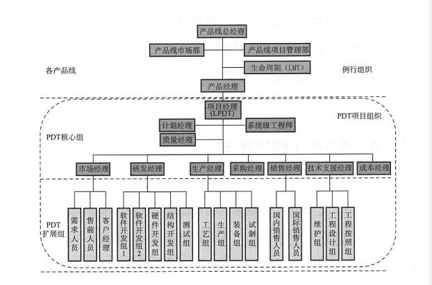
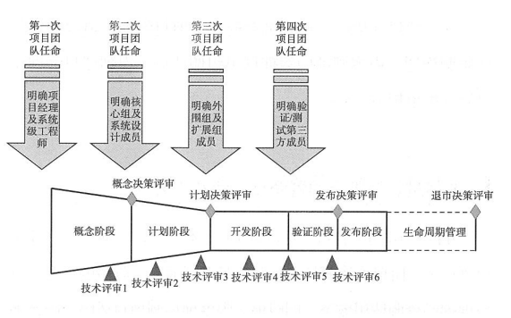
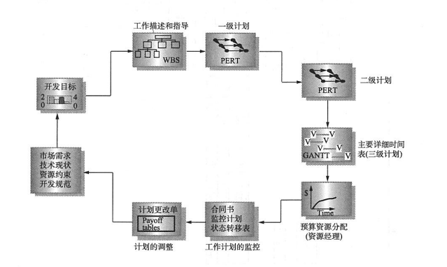
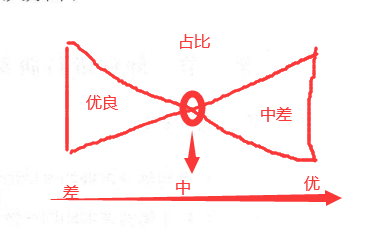
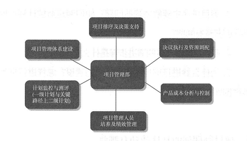

- ## 流程如何有效结合项目管理
  - 随着企业的发展，面对的项目越来愈多，业务线随之拉长，如果还是一套管理模式，不论是资源消耗，还是产品质量都难以保障。企业发展到一定的时期，对于单项目管理和多项目管理要实现分离。
  - 对于我的理解，类似公司层级的模式，如华为横向实现管理，纵向对目标负责。
  - 有一个总负责人、一个技术负责（技术质量），项目实行强矩阵或和弱矩阵，有绩效管理。
  - 文中给出一个典型的项目团队结构图
  - 
    - 一个产品的成败离不开一个高效的项目管理方法，前面理解过产品经理与项目经理的区别，项目经理在产品开发过程中是市场和财务的第一责任人。这里记录主要实现四个管理：
      - 管理好目标：产品的市场成功和财务成功
      - 管理好项目：控制过程，对计划、资源、绩效和基线负责
      - 管理好领导：及时汇报、及时求助、及时评审
      - 管理好自己：全流程全要素，解决冲突、维护核心成员、学习业务知识、财务知识
    - 一个项目管理中的核心成员一般包括：系统经理、研发、市场、营销及采购与项目相关业务代表，要求与项目经理共同对项目的市场和财务成功负责。
    - 强矩阵和弱矩阵的关系前面已有了解。单人单项目可以实现强矩阵，只对项目负责人汇报，资源对应负责人间接汇报；多人多项目可弱矩阵，只对资源负责人直接汇报，负责的多项目间接汇报。说白话一些就是，强矩阵的资源部门人进入项目，对项目负责；弱矩阵的是项目分包需求进入资源部门，资源部门人对需求负责。
    - 实现分阶段资源投入及时释放上一阶段资源，提高资源使用率
      - 项目过程中文档和交接文件必须齐备，保证在项目团队成员之间能顺利交接项目相关内容
      - 项目团队组建任命书，明确成员及资源投入
      - 及时进行项目成员的项目绩效考核
      - 资源无法满足时，及时修改计划，减少需求，进行外包
  - 
  - 什么是研发的三级计划？
    - 当前工程项目中，都强调要有结构化的设计思维，上一次的学习笔记中已经了解，阶段、步骤、任务、活动的三级体系流程，其实这里就是分别对应的三次流程的三级计划。
    - 一级计划：总体计划，各个阶段、决策评审点和技术评审点、重要步骤进行明确，协调资源
    - 二级计划：解决各部门之间的协同问题，识别项目关键路径
    - 三级计划：知道员工具体工作计划，分解到个人独立完成工作量，明确输出件及评价要素
  - 
  - 评审体制一直被人忽视，当前各个项目中也存在着相同的问题，各个阶段的评审应该注意什么呢？
    - 一级计划评审：主要考虑项目周期、时间分配、资源需求、关键路径、核心技术、关键技术、人员任职资格等风险
    - 二级、三级计划评审：主要有项目经理和核心组员完成，对当前条件是否符合一级计划内容，三级计划活动中，责任人，工时、输出件、评价要素的合理性进行评估。核心技术、关键技术是否满足，成员能力是否达到要求
  - 很多时候，绩效考核被当作是克扣的代名词，其实理解上有很大的偏差，前面说过，组织绩效与个人绩效需要分离，但组织绩效是个人绩效的前提。对项目经理的考核一般就是项目（组织）的绩效考核，项目组成员绩效受其结果影响。如果项目考核非常优秀，那中差的比例可以降低
  - 
    - 考核的主要方向可以看：项目交付情况、财务情况、共享情况、被共享情况、团队能力提升、经理能力提升
  - 项目管理部的职责会更加宏观一些
  - 