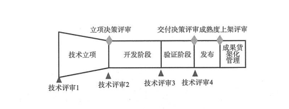
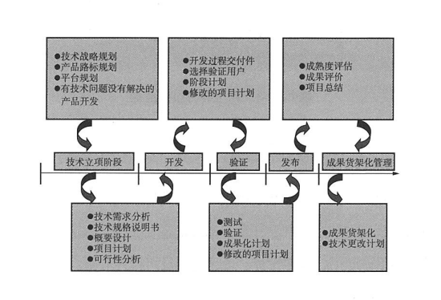
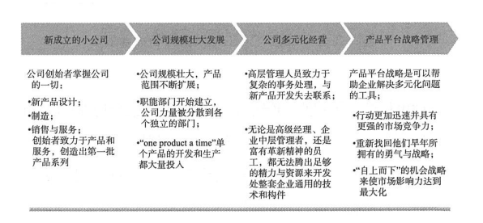
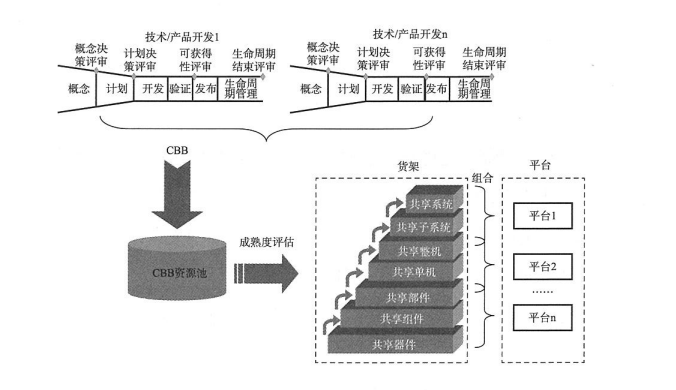

- ##  发展核心技术平台巩固技术
  - 深入理解技术含义，技术可以分为：
    - 核心技术
    - 关键技术
    - 一般技术
    - 通用技术
  - ### 技术型企业在发展过程中，使用的技术会累计繁杂，如何有效辨别这些技术是否带来驱动力？越多越好吗？并不见得如此，但是核心的技术必须自主研发并越多越好。
  - 前面我们知道，产品开发和技术开发分离后，如果产品开发中使用到未完成的核心技术以及关键技术，应该提前进行预研环节。产品开发尽量使用成熟的技术货架能力，共享技术和产品平台。
  - 平台可以往后规划，一般是对已有的产品技术向后筛选，完成共享整理和开发，再进行完成的平台方向规划
  - 那么产品开发和技术开发分离的具体问题有哪些？
    - 1、产品因技术风险不能按期退出，市场变化，影响产品需求以及整体规划
    - 2、产品功能稳定性差，重复回炉造成资源浪费
    - 3、影响开发项目人员因此的绩效评定
    - 4、增加了产品管理的周期和不稳定因素
  - 那么在使用过程中，怎么区分核心技术、关键技术
    - 核心技术一般指的是企业领先行业的独门秘籍，能在一段时间保持市场领先，开发中核心使用的能力
    - 关键技术是产品开发过程不可或缺的核心分支能力，组合技术能力也是能力，出现在关键位置关键路径
    - 一般技术是普通使用技术，可有有多种方案替换
    - 通用技术是已经有的发布的标准技术
  - ### 大多数大企业子在一般技术和通用技术上进心外包，而对核心技术和关键技术进行知识产品保护，这些技术具有：独有性、竞争性、可拦截性、不可替代性、可管理可保护、产生价值
  - 对于核心技术或者关键技术，适用技术开发管理，一般核心技术和关键技术会有进行探索和突破，实行研发目的，着眼于技术和原理，具有风险性，流程和项目管理与产品开发子啊原理上虽然同样有六个阶段，但在交付成果、管理模式及项目开发团队均有不同。
  - 技术开发流程包括：
    - 技术项目立项:通过对技术战略规划、产品路线规划、平台规划、有技术问题没有解决的产品开发；阶段主要完成技术需求分析、技术规格说明、概要设计、项目计划及可行性分析
    - 项目研发：对概要设计完成研发详细设计，选择验证用户，修改项目计划
    - 项目成功验证：测试、验证、成果化计划并修改项目计划
    - 项目成功发布：选择试点，技术成熟度评估，项目总结
    - 货架管理：通过评估技术，规整货架，结合实际应用技术改进
  - 
  - 
  - 货架及平台需要技术开发的不断积累和有效管理，一个技术开发的项目与产品开发的项目在管理上是不同的：
    - 计划制定方面：产品开发的计划一般不可更改，周期分布；技术开发，或者预研项目，每个阶段都要制定对应计划
    - 项目管理方面：技术开发一般由研发人员做项目经理，技术开发团队人员规模小；产品开发一般都是产品经理，或者市场经理。
    - 绩效管理：产品开发绩效过程结果都严格，对结果市场负责；技术开发过程严格，允许失败
    - 营销：面对对象不同，产品开发对接客户，技术开发成功一般是产品经理
  - ### 有了一定的技术积累，形成货架，那平台的规划就提上日程，书籍中有句话说的没错，这个时代的企业，没有大小之分，只有快慢之分和成本高低之分。
  - 要想快速产出，多客户需求得到满足，必须建立公共共享技术平台和技术平台。这种平台战略不是一蹴而就的，需要有以下一些能力建设：
    - 共用基础模块（CBB）：不同产品、系统共用的零部件、模块、技术及其他相关设计成果
    - 货架：将公司产品和技术进行层级结构统一管理，方便共享成果
    - 货架产品：小批量的成熟模块
    - 平台：货架产品在各个层级上的集合
  - 
  - 
  - 文中的科普知识：cbb和平台区别，平台产品是经过成熟度评估并有大量市场应用的cbb，主要分：原理样机、小批量、批量、转生产
  - 一般平台的诞生都是经过多年的总结和沉淀，也可以根据企业实际的需求，形成自己的平台规划。主要步骤:
    - 产品树分解：产品的拆分功能零件，有价值，可利用，可重复
    - 技术树分解：按照技术学科进行专业分类
    - 结合产品和技术分类进行分析
    - 发现共享技术，关键步骤
    - 将共享技术标准化和上层开发
    - 验证开发的平台有效性
    - 完善补充平台、升级技术
  - 通过长时间的积累，也需要研发人员的热情投入，短期内见效不会容易，通常的伴随激励机制
    - 通过任职资格进行引导开发
    - 将平台进行内部定价
    - 对非竞争客户进行对外销售
    - 对平台开发给与战略补贴和特别激励
