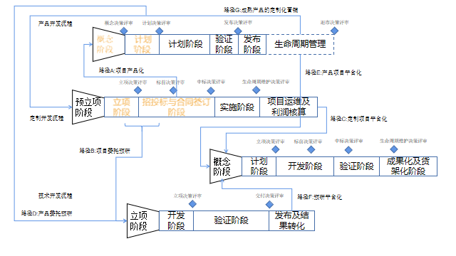
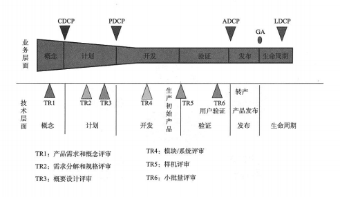
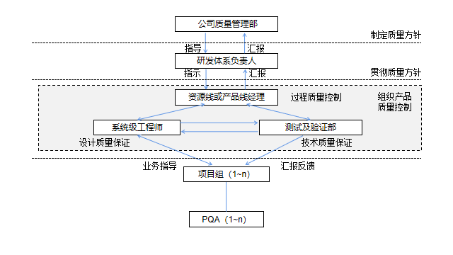

1、是否需要增加产品经理这个岗位，为什么要增加这个岗位
个人觉得需要，并且项目主导需交还市场和目标，既然是产品开发，选择技术型做项目经理，文中有对比产品经理和项目经理的职责，产品经理来源专业市场或熟悉市场人员，清楚从M、R、V版本的内容，而项目经理主要负责技术职能版本，更加偏向短期技术市场实现，并且可以回归技术归类的货架及平台积累。如果让技术担任市场和财务负责方向，即完成不好市场财务，又失去时间完成货架及平台的技术积累。

2、质量保障部公司级别还是部门级的比较，该部门的主要工作内容有哪些
从了解的情况来说，质量保障一般属于公司级别，属于制定质量方针及规划的，如果是部门级的更多的是偏向资源线中的测试部。测试部在于事后优化和缺陷归零管理，质量保障要在设计中构建质量优势，质量设计主体为系统级工程师，明确评审责任主体为主审人，质量计划责任主体就是项目经理。对产品应用技术和没有认证的核心器件提前规划和预研，确保没有使用为突破技术及为论证器件。对以上人员进行绩效考核，设立产品的成熟度评估，对各层次产品进行鉴定和分类。个人理解是进行货架整理，平台的归类。

3、产品开发、技术开发、平台开发都涉及到哪些内容，以及如果落地
主要关系大致如图，涉及到落地会有各方关系，比如支撑、规划、公司情况等，只有适合自己的才是最好的。

## 质量管理要如何形成体系？
  - 和我上面回答的问题一样，很多时候质量管理并非与测试管理一样。很多人呢会有这方面的误区，即质量管理是对后期的缺陷管理？答案是否定的，它更加偏向构建质量方针，设计过程中构建质量优势。
  - 很多企业包括当前我们自己公司，花费大量时间去评审，但没有评审的监督和负责人，没人进行追踪和考评，导致评审走过场，需求反复改，技术频繁更替。整个过程没有技术积累的整理，没有模块化和技术成熟度考虑，没有一个系统级工程师进行系统规划控制，使用经验欠缺人员进行担责，造成员工自我价值难以体现，福利待遇受到限制。
  - ### 构建质量体系的六个要素
      - 一套流程：质量管理体系与产品开发流程并不是孤立的，在产品开发过程中有六个技术评审点，将测试和验证作为独立阶段，有效衔接整个产品开发过程
      - 两个原则：
        - 业务决策评审与技术质量评审分离，设立高级版主审人，同时对主审人进行绩效考核
        - 建立产品货架（CBB），必须保证成熟模块占一定比例。
      - 三个职位：
        - 系统工程师：对产品的总体方案设计负责
          - 产品需求管理：定义产品需求、产品概念、评估技术风险；订制实施知识产权及CBB共享
          - 产品开发总体方案管理
          - 技术领域开发项目的质量管理
          - 技术基线控制
          - 设计开发、验证、制作及维护工作协调
        - 主审人：对方案的评审负责
        - PQA：对方案执行过程中的质量监控负责
          - 
      - 四个分离：
        - 规划与系统设计分离
        - 设计与实现分离
        - 实现与测试分离
        - 测试与验证分离
      - 五中手段：
        - 规划和CBB共享
        - 评审：文档评审和关键点的技术决策评审
        - 测试和验证
        - 任职资格与活动匹配：低级别工程师不参与方案设计
        - 缺陷归零管理
      - 六个评审点：
      
        - 产品需求和概念评审
        - 需求分解和规格评审
        - 概要设计评审
        - 模块、系统评审
        - 样机评审
        - 小批量评审
    - 
    - 